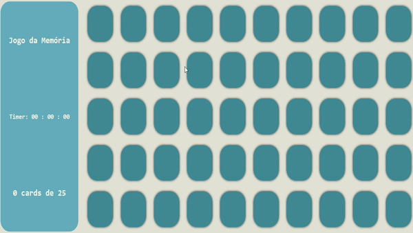

# Projeto Jogo da Memória
Um jogo da memória, feito apenas em HTML, CSS e Javascript. 
Usando pares de números gerados aleatoriamente e posicionados em divs.
A ideia é simples, ache dois números iguais e ganhe um ponto.
Um projeto simples e interessante de fazer, sendo muito satisfatório colocar os estudo em pratica em pequenos projetos.

### Imagem da página

